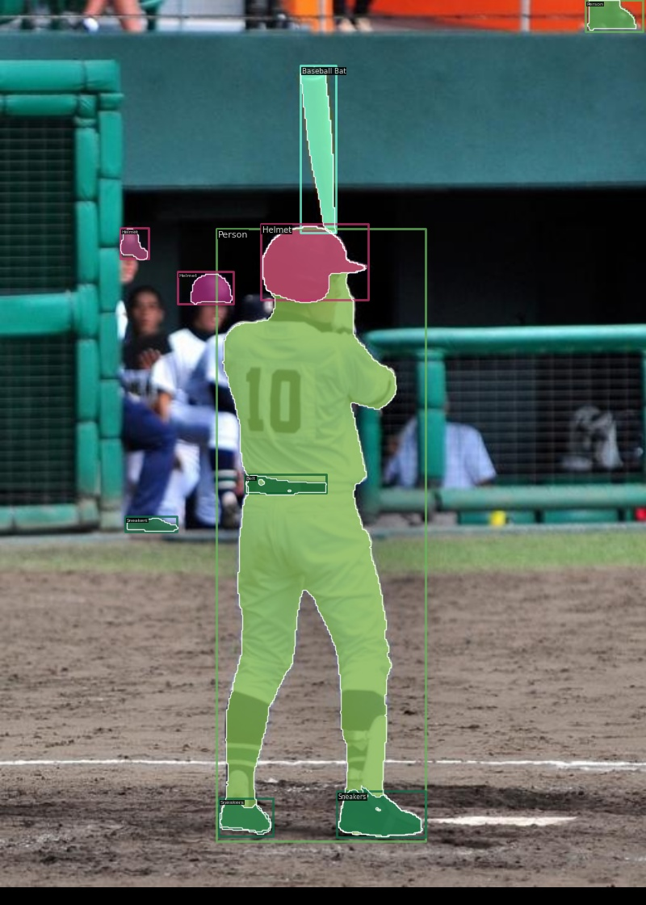
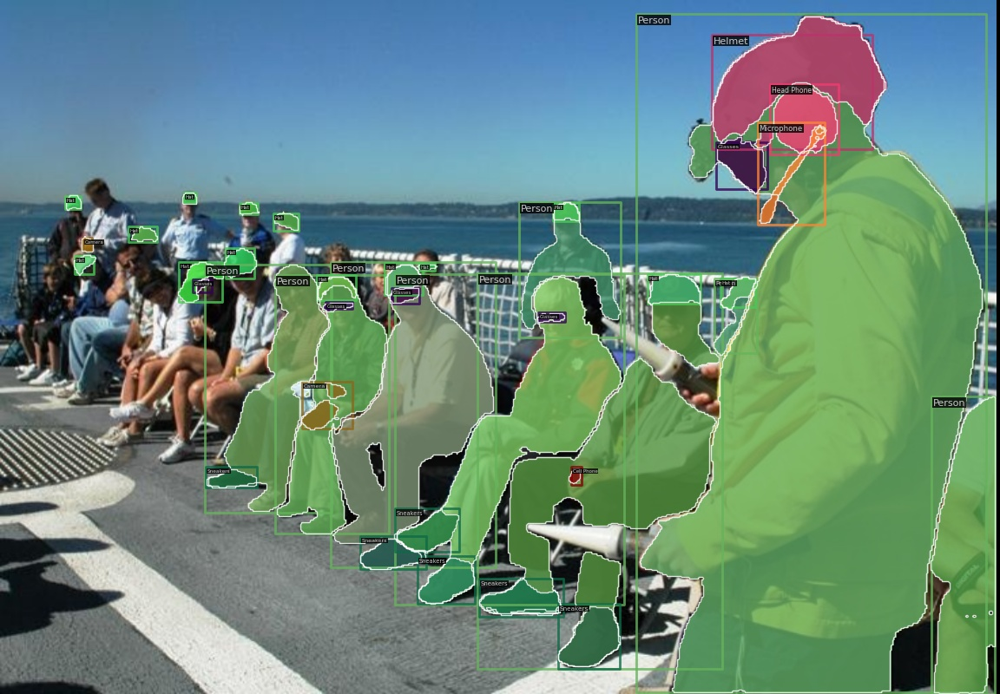
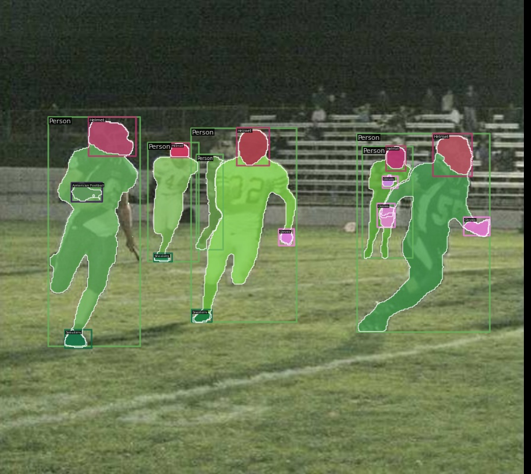

# SAM-Objects365

## Citation
If you use our dataset, please kindly cite these projects.
```
@inproceedings{shao2019objects365,
  title={Objects365: A large-scale, high-quality dataset for object detection},
  author={Shao, Shuai and Li, Zeming and Zhang, Tianyuan and Peng, Chao and Yu, Gang and Zhang, Xiangyu and Li, Jing and Sun, Jian},
  booktitle={Proceedings of the IEEE/CVF international conference on computer vision},
  pages={8430--8439},
  year={2019}
}
@misc{sam_objects365,
  title = {SAM-Objects365},
  author = {Kaining Ying},
  howpublished = {\url{https://github.com/KainingYing/SAM_Objects365}},
  note = {Accessed: 2025-02-11},
  year = {2025}
}

```

## TODO
- [x] Release the download links.
- [ ] Release the toturial.

## Introduction

The goal of this project is to use [SAM](https://github.com/facebookresearch/segment-anything) to annotate masks on the basis of carefully annotated target detection datasets [Objects365](http://www.objects365.org/overview.html), thereby facilitating large-scale pre-training of general instance segmentation. The specific process is shown in the figure below

## Visualizations
We provide some annotations of our SAM-Objects365. More visualizations please refer to [this link](https://github.com/KainingYing/SAM_Objects365/releases/download/demo/obj365_500.zip).

<table>
  <tr>
    <td></td> 
    <td></td>
  </tr>
  <tr>
    <td></td>
    <td></td>
  </tr>
</table>

## How to use SAM-Objects365 ?

### Download
Firstly, you should download the Objects365 v2 by running following:
```shell
python download_dataset.py \
    --dataset-name objects365v2 \
    --save-dir ${SAVING PATH} \
    --unzip \
    --delete  # Optional, delete the download zip file
``` 

Next you need download following mask annotations:

**BaiduNetDisk**: https://pan.baidu.com/s/1KLncoQ9u7-ABrgyBKCwxGg (1234)

**OneDrive**: https://1drv.ms/f/s!AqU-46ABHrbCgc8bS9HfrrYjthzf0Q?e=6CHGjs

This dataset folder sholud be like:

```
objects365_v2
├── annotations
│   ├── sam_obj365_train_1742k.json
│   ├── sam_obj365_train_75k.json
│   ├── sam_obj365_val_5k.json
│   ├── zhiyuan_objv2_train.json
│   └── zhiyuan_objv2_val.json
├── sam_mask_json
│   ├── sam_obj365_train_1742k
│   ├── sam_obj365_train_75k
├── train
└── val
```

## Acknowledgement

We would like to express our heartfelt thanks for the following projects:

- [Segment Anything](https://github.com/facebookresearch/segment-anything)
- [Objects365](http://www.objects365.org/overview.html) [Lincense](https://www.objects365.org/download.html)
